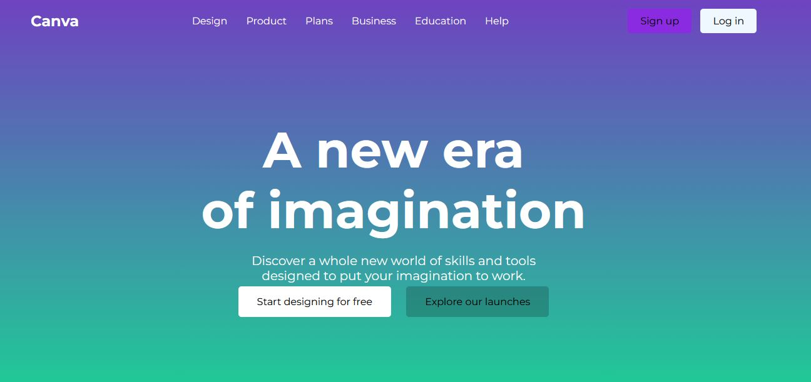

✨ Canva Style Hero Section (Built with Gemini CLI)
his project was created as a class assignment where the task was to convert a given screenshot into code using Gemini CLI.
The Hero Section design replicates the provided Canva layout, focusing on pixel-perfect alignment, responsive design, and clean UI structure.

](assignmentcanva.JPG)
